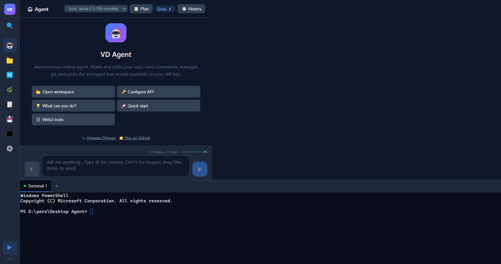
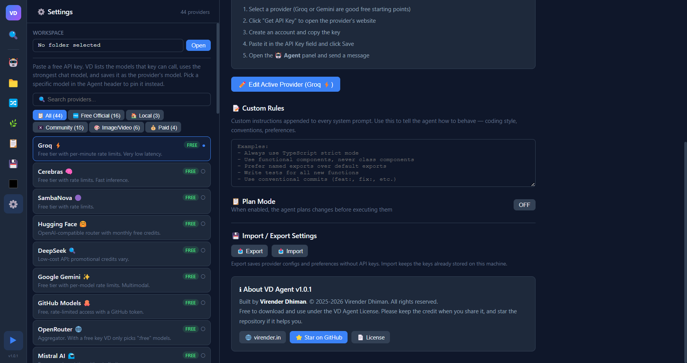

<!--
  @author Virender Dhiman
  @year 2026
  @project VD Agent
  @license Proprietary. See LICENSE.
-->

# VD Agent

**A desktop AI coding agent that works with free API keys.**

VD Agent by [Virender Dhiman](https://virender.in) · [VD Agent License](./LICENSE): free to use, credit required

[](https://github.com/virrdhiman/desktop-agent/stargazers)
[](https://github.com/virrdhiman/desktop-agent/releases)




---

## What is VD Agent?

VD Agent is a desktop app that pairs an AI coding assistant with a code editor, terminal, and git client for the projects on your computer. You describe a task, and the agent reads your code, edits files, runs commands, and checks its own work with your project's tests and build.

It is built to work well on **free API keys**. It asks your key which models it can use, picks the strongest chat model, and moves on to the next one when a model is rate-limited or unavailable. It can also run fully offline with a local model such as Ollama.

Your chats, settings, and keys stay on your machine. There is no account and no telemetry.

## Features

- **Agent that verifies its work.** Reads before it claims, pushes back on risky requests, runs your tests or build before it reports success, and asks before destructive actions.
- **Modern agentic environments.** Choose Normal, Smart, or Agentic. Substantial chat requests can move through a prompt analyst, optional specialists, tool-enabled worker, independent reviewer, bounded repair, and final verifier. Team presets, token budgets, custom roles, and a visual trace panel keep the workflow strong without wasting tokens. See [Agentic Environments](./docs/MULTI_AGENT.md).
- **Tools.** Files, code search, shell commands, git, web search, and some media and Web3 helpers. See [TOOLS.md](./TOOLS.md).
- **Safe archive-to-CSV workflows.** Inventories ZIP files before extraction, rejects unsafe entries, and guides the agent to inspect every source, preserve provenance, and verify structured CSV output.
- **Plan Mode.** The agent proposes a plan and waits for your approval before it changes files.
- **Automatic model selection.** Discovers and ranks the models your key can call, and falls back between models and providers. See [How model selection works](#how-model-selection-works).
- **Durable resume and recovery.** Chats, tasks, workspace state, recent tool outcomes, terminal context, and verification state survive restarts. Agent file edits get pre-change recovery checkpoints.
- **Searchable chat history.** Reopen, rename, pin, search, export, import, restore, or delete local sessions.
- **Technical safety controls.** Electron-native approval prompts protect commands and destructive Git/file actions; writes outside the open workspace are blocked.
- **Built-in tools for developers.** Monaco code editor, multi-tab terminal, git status, diff, commit, branches, and a command palette (`Ctrl+P`).
- **Custom Rules.** Your own conventions added to every request.



---

## Download and Install

1. Open the [Releases page](https://github.com/virrdhiman/desktop-agent/releases) and download the file for your system:

   | System | File |
   |--------|------|
   | Windows 10/11 (64-bit) | `VD Agent Setup <version>.exe` (installer) or `VD Agent <version>.exe` (portable) |
   | macOS | `VD Agent-<version>.dmg` (Apple Silicon builds end in `-arm64`) |
   | Linux (64-bit) | `VD Agent-<version>.AppImage` or `vd-agent_<version>_amd64.deb` |

2. Optional but recommended: check the file against `SHA256SUMS.txt` from the same release. See [verify your download](./docs/INSTALL.md#verify-your-download).
3. Install and launch it. If Windows SmartScreen or macOS Gatekeeper warns about an unsigned build, see [first launch](./docs/INSTALL.md#first-launch-warnings).

If no release is listed yet, [run from source](#run-from-source). Full instructions, updating, and uninstalling are in [docs/INSTALL.md](./docs/INSTALL.md).

## Run from source

You need **Node.js 20.19 or newer**, **git**, and native build tools for the terminal (`node-pty`). See [prerequisites](./docs/INSTALL.md#run-from-source).

```bash
git clone https://github.com/virrdhiman/desktop-agent.git
cd desktop-agent
npm install
npm run dev
```

To build your own installer, run `Win\build.bat`, `bash Mac/build.sh`, or `bash Linux/build.sh`. See [docs/RELEASE_CHECKLIST.md](./docs/RELEASE_CHECKLIST.md).

---

## Free API key setup

You need one key to start. Groq and Google Gemini have free tiers and are good first choices.

1. Open **Settings** (⚙️ in the sidebar) and select **Groq** or **Google Gemini**.
2. Click **Get API Key**. The provider's site opens in your browser. Create a key there and copy it.
3. Paste the key into VD Agent and click **Save**. Selecting a provider in the list also makes it the active one.
4. Open a project folder (📁 **Files → Open**), go to 🤖 **Agent**, and send a message.

No key? Install [Ollama](https://ollama.com/download), run `ollama pull llama3.3`, and pick **Ollama (Local)** in Settings. Prompts never leave your machine.

Adding keys for more than one free provider makes rate limits less of a problem, because VD Agent can fall back between them. Free-tier limits are set by each provider and change often. See [docs/PROVIDERS.md](./docs/PROVIDERS.md) for other providers and their trade-offs.

### How model selection works

For OpenAI-compatible providers, VD Agent:

1. Lists the models your key can call and drops non-chat models such as embeddings, speech, image, and moderation models.
2. Ranks the rest by coding quality and efficiency, then learns from local success, failure, and latency history. If a live list is available, stale saved model IDs are dropped automatically.
3. Moves to the next model on rate limits (429), model-not-found or unsupported model errors, overload, and 503s.
4. **Stops immediately on an invalid key**, so you can fix it instead of having the problem hidden.
5. Saves the refreshed live model list and the model that worked, unless you pinned a model in the Agent header.

If the active provider fails for any reason other than an invalid key, VD Agent tries other official free providers that have keys. Local servers and community proxies are never used automatically.

---

## Privacy and local data

VD Agent has no server, account, telemetry, or analytics. Everything it stores stays in your user data folder:

| OS | Folder |
|----|--------|
| Windows | `%APPDATA%\VD Agent` |
| macOS | `~/Library/Application Support/VD Agent` |
| Linux | `~/.config/VD Agent` |

- **Chats**: `conversations/<id>.json`, one file per chat. API keys are redacted before a chat is written.
- **Recovery checkpoints**: `checkpoints/<session-id>/`, bounded pre-edit copies of files changed by agent file tools.
- **Project memory**: `project-memory/`, a deterministic local summary used to resume work with repository context.
- **Settings**: `settings.json`, with provider configuration, custom rules, and preferences.
- **API keys**: stored in `settings.json` and encrypted with your OS keychain (Electron `safeStorage`) when one is available. On Linux without a keyring they are stored unencrypted. Keys are never included in settings exports.
- **Private diagnostics**: an optional local JSON export contains app/runtime metadata and aggregate health counts only. It excludes API keys, chats, filenames, workspace paths, and source code.

Your prompts and code go **only** to the AI provider you choose, plus any service an agent tool calls on your behalf (for example web search). Details are in [docs/PRIVACY.md](./docs/PRIVACY.md). The agent runs commands with your user permissions, so read [docs/SECURITY.md](./docs/SECURITY.md) before pointing it at important work.

---

## Documentation

| Guide | What's in it |
|-------|--------------|
| [USAGE.md](./USAGE.md) | Using the agent, editor, terminal, git, chat history, and shortcuts |
| [docs/INSTALL.md](./docs/INSTALL.md) | Installing, verifying downloads, updating, uninstalling, running from source |
| [docs/PROVIDERS.md](./docs/PROVIDERS.md) | Setting up providers, local models, and how fallback works |
| [docs/PRIVACY.md](./docs/PRIVACY.md) | What is stored, where, and what leaves your machine |
| [docs/SECURITY.md](./docs/SECURITY.md) | Security model, safe use, and reporting vulnerabilities |
| [docs/AI_AGENT_TESTING.md](./docs/AI_AGENT_TESTING.md) | Functional, trajectory, and visual testing for the agent |
| [docs/MULTI_AGENT.md](./docs/MULTI_AGENT.md) | Agentic environments, custom roles, safety boundaries, provider use, and limits |
| [docs/VSCODE_BRIDGE.md](./docs/VSCODE_BRIDGE.md) | Optional VS Code extension bridge for active editor, selection, and open-file context |
| [docs/RESUME_AND_RECOVERY.md](./docs/RESUME_AND_RECOVERY.md) | Restart resume state, local project memory, checkpoints, and rollback limits |
| [docs/TROUBLESHOOTING.md](./docs/TROUBLESHOOTING.md) | Fixes for common problems |
| [TOOLS.md](./TOOLS.md) | Reference for every agent tool |
| [ARCHITECTURE.md](./ARCHITECTURE.md) | How the code is organized |
| [docs/CONTRIBUTING.md](./docs/CONTRIBUTING.md) | Development setup and pull requests |
| [docs/RELEASE_CHECKLIST.md](./docs/RELEASE_CHECKLIST.md) | Building, signing, and publishing releases |
| [CHANGELOG.md](./CHANGELOG.md) | Release history |

---

## Support the project

If VD Agent saves you time, starring the [GitHub repository](https://github.com/virrdhiman/desktop-agent) helps other people find it. Starring is a request, not a condition of the license.

If you share, review, demo, or write about VD Agent, the license asks you to credit it:

```
VD Agent by Virender Dhiman - https://virender.in
```

Please link to https://github.com/virrdhiman/desktop-agent as well. Bug reports and pull requests are welcome; see [docs/CONTRIBUTING.md](./docs/CONTRIBUTING.md).

## License

Copyright (c) 2025-2026 [Virender Dhiman](https://virender.in). All rights reserved.

VD Agent is proprietary, source-available software and the exclusive property of Virender Dhiman. From version 1.0.1 it is licensed under the [VD Agent License](./LICENSE):

| You may | You may not |
|---------|-------------|
| Download it from the official repository or releases, and build it | Sell, redistribute, or republish it, modified or not |
| Use it free of charge for personal and commercial work | Remove or change the name, logo, or author credits |
| Modify your own copy for your own use | Offer it, or a service based on it, as a hosted service |

Credit is required when you share or showcase it. VD Agent is built on open-source dependencies such as Electron, React, and Monaco Editor, which keep their own licenses (many are MIT-licensed); those licenses cover the dependencies, not VD Agent itself. This summary is for convenience and is not legal advice; the [LICENSE](./LICENSE) file is the binding text. For permissions the license does not cover, contact the author through [virender.in](https://virender.in).
